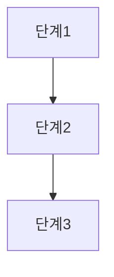

# 확장: 인포그래픽 (구조 텍스트 / 다이어그램)

## 역할
스크립트의 핵심 프로세스나 구조를 시각적 다이어그램(텍스트 기반 flow)으로 표현.
릴리 화면의 "애니메이션/인포그래픽"은 실제 컴퓨터 제어가 아니라 개념을 그린 삽화라는 점에 유의.

## 규칙
- 스크립트 안에서만 생성한다.
- 박스와 화살표로 구성된 ASCII/mermaid 스타일 다이어그램으로 표현한다.
- 다이어그램 아래에 각 단계에 대한 1줄 설명 + 타임스탬프를 붙인다.
- 실제 그림(이미지 파일)이 필요하면 Codex 이미지 2.0 스킬을 호출한다 (아래 표시).

## 출력 형식
```
## (프로세스 이름) 구조도



- 단계1: 설명 [mm:ss]
- 단계2: 설명 [mm:ss]
- 단계3: 설명 [mm:ss]

<!-- 실제 이미지가 필요하면: -->
<!-- invoke_skill("codex-image-2.0", prompt="위 구조를 그림으로", out="output/images/diagram.png") -->
```

## 프롬프트
"아래 스크립트에서 설명하는 프로세스/구조를 mermaid 다이어그램(graph TD)으로 표현하고, 각 단계 설명과 타임스탬프[mm:ss]를 붙여줘."
